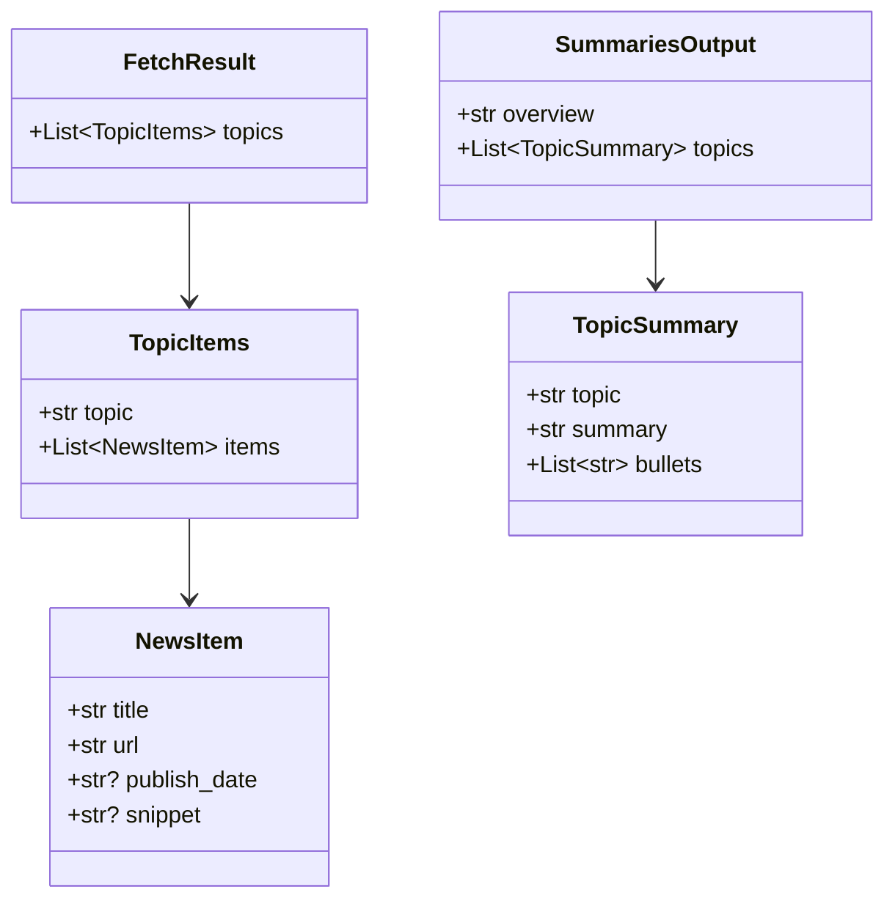
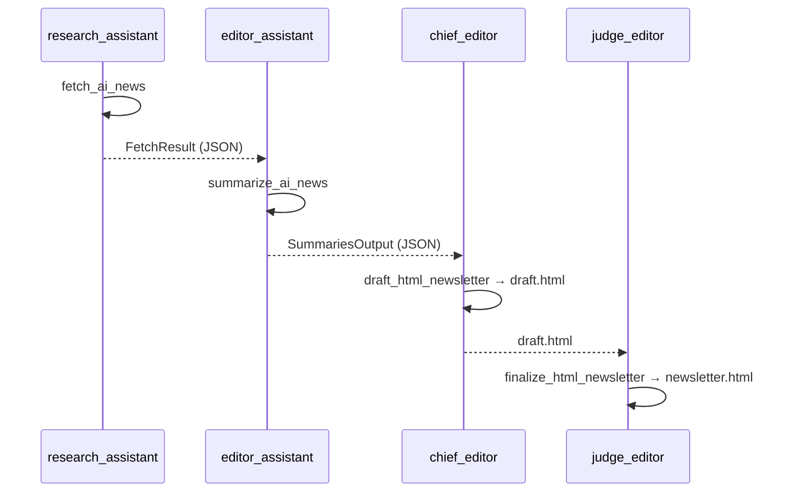
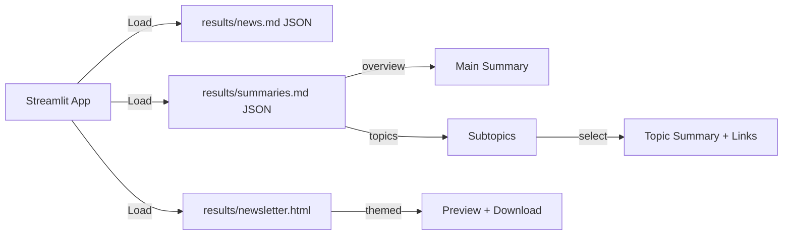

## AI_NEWS Architecture and Flow

This document describes the system architecture, agent-task pipeline, data contracts (Pydantic), and the Streamlit UI flow.

### High-level Workflow

```mermaid
flowchart TD
    A[User] -->|Run Crew| B[Assignment.crew]
    B --> C[fetch_ai_news (research_assistant)]
    C -->|FetchResult JSON| D[summarize_ai_news (editor_assistant)]
    D -->|SummariesOutput JSON| E[draft_html_newsletter (chief_editor)]
    E -->|draft.html| F[finalize_html_newsletter (judge_editor)]
    F -->|newsletter.html| G[Streamlit App]
    G -->|Preview + Download| A
```

### Agents and Tasks

- Agents (from `src/assignment/config/agents.yaml`):
  - `research_assistant`: searches the web
  - `editor_assistant`: summarizes per topic
  - `chief_editor`: drafts HTML
  - `judge_editor`: finalizes HTML

- Tasks (from `src/assignment/config/tasks.yaml`):
  - `fetch_ai_news` → outputs `results/news.md` as FetchResult JSON
  - `summarize_ai_news` → outputs `results/summaries.md` as SummariesOutput JSON
  - `draft_html_newsletter` → `results/draft.html`
  - `finalize_html_newsletter` → `results/newsletter.html`

### Data Contracts (Pydantic)

`src/assignment/schemas.py`



### Crew Wiring

`src/assignment/crew.py`

- `fetch_ai_news` uses `output_pydantic=FetchResult` and saves to `results/news.md`
- `summarize_ai_news` uses `output_pydantic=SummariesOutput` and saves to `results/summaries.md`
- Downstream tasks build `draft.html` and `newsletter.html`



### Streamlit UI Flow

File: `streamlit_app.py`



UI details:
- Sidebar: Run button, Subtopic selector (canonical order)
- Main: Top = overview (prefers HTML Overview/Executive Summary from `newsletter.html`), Right = selected topic summary + bullets + links, then final newsletter preview and download.

### Runbook

- Using uv (recommended)
  - `cd /Users/sankar/sankar/courses/agentic-ai/crew_basics_and_prompting/AI_NEWS`
  - `uv sync`
  - `export SERPER_API_KEY="..."`
  - `uv run python -m assignment.main`
  - `uv run streamlit run streamlit_app.py`

- Plain venv
  - `python3 -m venv .venv && source .venv/bin/activate`
  - `pip install -e .`
  - `export SERPER_API_KEY="..."`
  - `python -m assignment.main`

### Troubleshooting

- JSON serialization error (HttpUrl): ensure `schemas.py` uses `str` for URLs
- Pydantic union errors: avoid PEP 604 unions; use `Optional[str]`
- Short overview in app: the app now prefers HTML overview; ensure newsletter has an `<h2>` like “Overview” or “Executive Summary”
- Topic references count: `tasks.yaml` now requires ≥5 items per topic and ≥5 links per topic in summaries

### Future Enhancements

- Add quality checks (validate ≥5 links per topic in UI)
- Add caching for searches
- Add filters (date range, sources)


