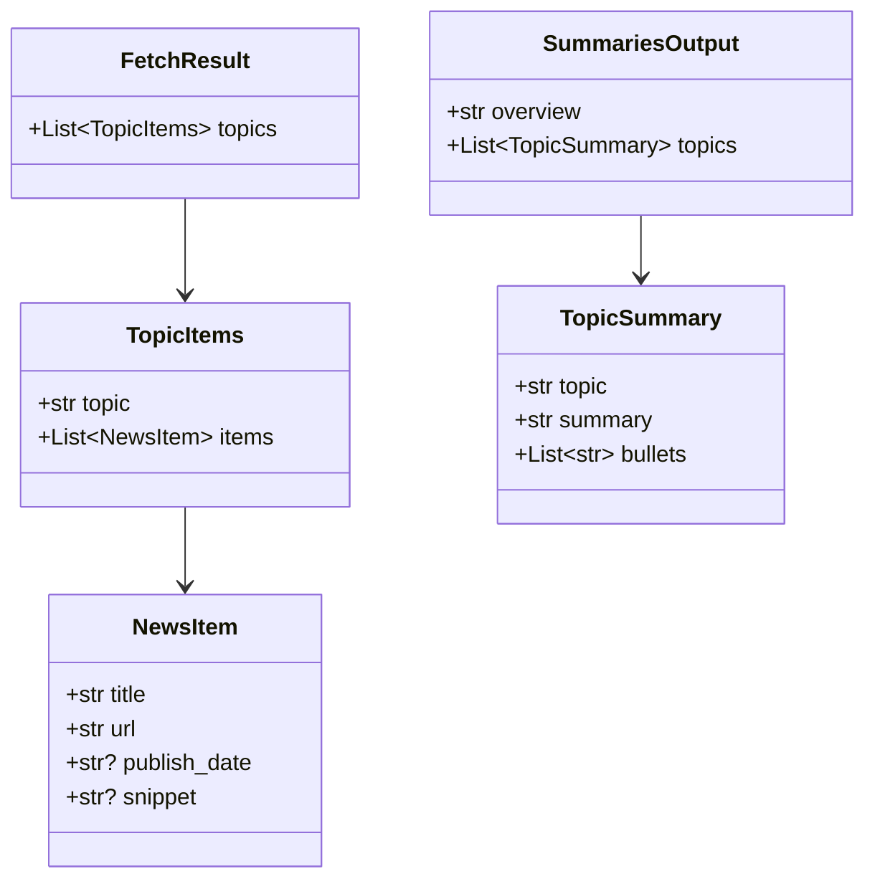
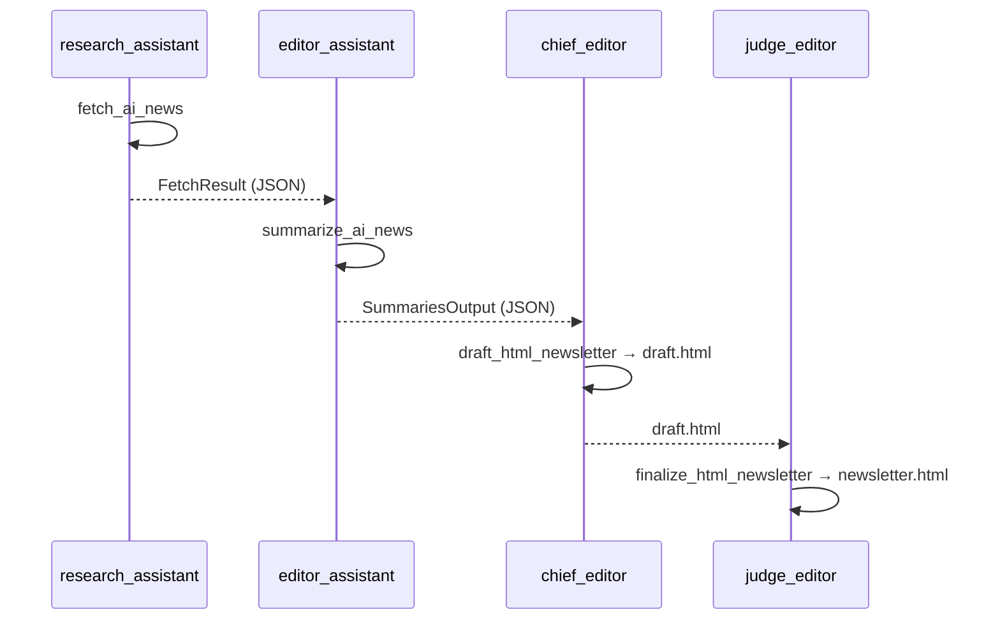
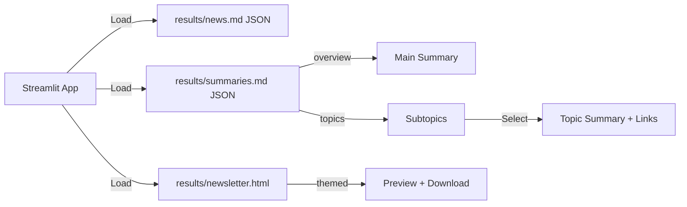

## AI_NEWS Project Documentation

### Overview
AI_NEWS is a CrewAI-powered pipeline that researches AI-in-health topics, summarizes findings by subtopic, and produces a styled HTML newsletter. A Streamlit app provides an interactive view with a main summary, clickable subtopics, per-topic summaries with links, and a final downloadable newsletter.

Repository root: `/Users/sankar/sankar/courses/agentic-ai/crew_basics_and_prompting/AI_NEWS`

### End-to-End Flow
```mermaid
flowchart TD
    A[User] -->|Run Crew| B[Assignment.crew]
    B --> C[fetch_ai_news (research_assistant)]
    C -->|FetchResult JSON → results/news.md| D[summarize_ai_news (editor_assistant)]
    D -->|SummariesOutput JSON → results/summaries.md| E[draft_html_newsletter (chief_editor)]
    E -->|draft.html| F[finalize_html_newsletter (judge_editor)]
    F -->|newsletter.html| G[Streamlit App]
    G -->|Preview + Download| A
```

### Agents and Tasks
- Agents (from `src/assignment/config/agents.yaml`):
  - `research_assistant`: Web research
  - `editor_assistant`: Per-topic summaries
  - `chief_editor`: Drafts HTML
  - `judge_editor`: Finalizes HTML

- Tasks (from `src/assignment/config/tasks.yaml`):
  - `fetch_ai_news` → outputs `results/news.md` as FetchResult JSON
  - `summarize_ai_news` → outputs `results/summaries.md` as SummariesOutput JSON
  - `draft_html_newsletter` → `results/draft.html`
  - `finalize_html_newsletter` → `results/newsletter.html`

### Data Contracts (Pydantic)
Source: `src/assignment/schemas.py` (enforced via `output_pydantic` in `src/assignment/crew.py`).



### Crew Wiring (Sequence)


### Streamlit UI Flow
File: `streamlit_app.py`



UI notes:
- Sidebar: Run button and controlled subtopic selector (canonical order)
- Main: Top overview (prefers HTML “Overview/Executive Summary” from `newsletter.html`); right panel shows selected topic; per-topic links at bottom.

### Runbook
Using uv (recommended):
```bash
cd "/Users/sankar/sankar/courses/agentic-ai/crew_basics_and_prompting/AI_NEWS"
uv sync
export SERPER_API_KEY="<your_key>"
uv run python -m assignment.main
uv run streamlit run streamlit_app.py
```

Plain venv:
```bash
python3 -m venv .venv && source .venv/bin/activate
pip install -e .
export SERPER_API_KEY="<your_key>"
python -m assignment.main
streamlit run streamlit_app.py
```

### Troubleshooting
- JSON serialization: use `str` for URLs (not `HttpUrl`).
- Union types: avoid PEP 604 unions; use `Optional[str]`.
- Short overview in app: app prefers HTML overview; ensure newsletter has an `<h2>` like “Overview” or “Executive Summary”.
- References per topic: `tasks.yaml` requires ≥5 items per topic and ≥5 links in summaries.

### Key Files
- `src/assignment/crew.py`
- `src/assignment/schemas.py`
- `src/assignment/config/agents.yaml`
- `src/assignment/config/tasks.yaml`
- `results/news.md`, `results/summaries.md`
- `results/draft.html`, `results/newsletter.html`
- `streamlit_app.py`
- `docs/architecture.md`, `docs/project_documentation.md`


